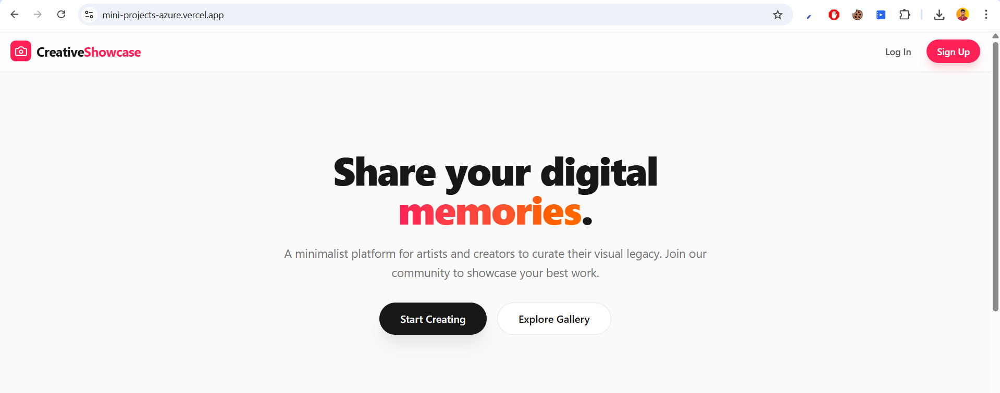
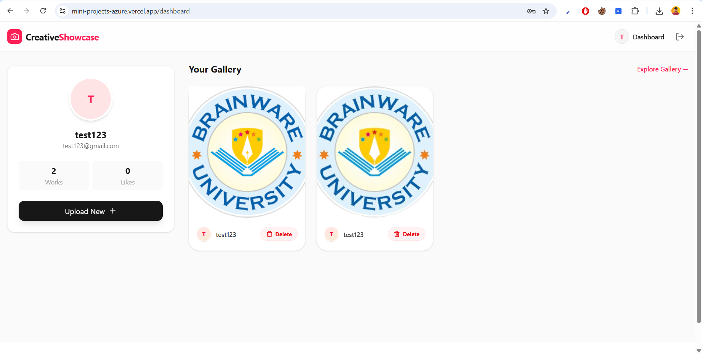
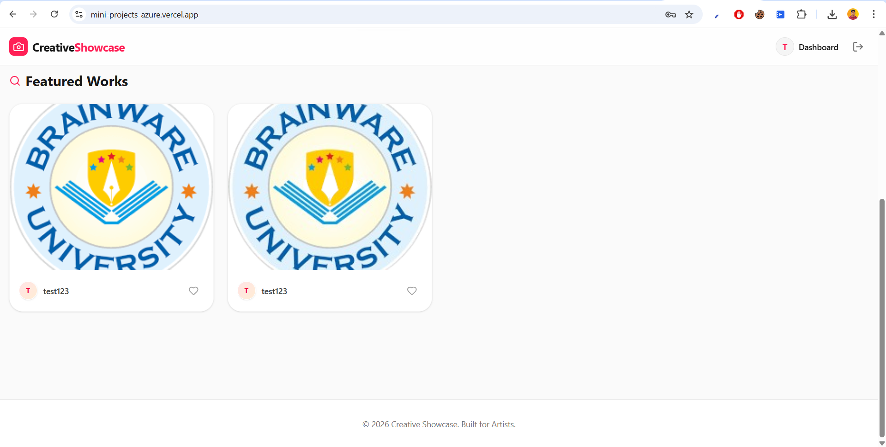
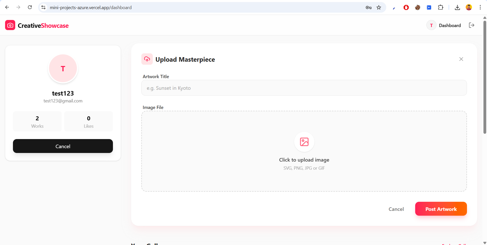
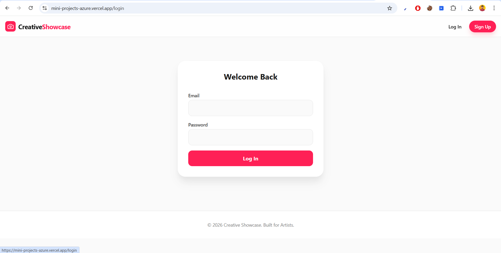
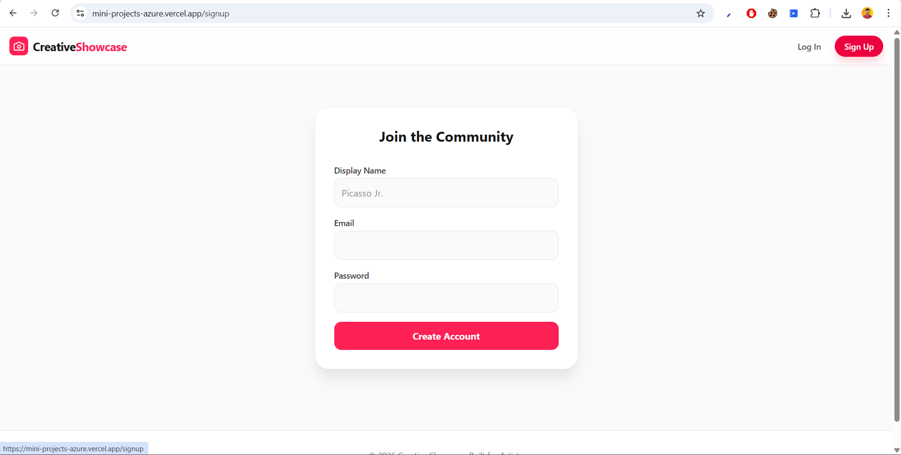

# 🎨 Creative Showcase – Task 1

> A full-stack **MERN-style** project where artists can sign up, log in, upload artworks, and showcase their creations.

[](https://mini-projects-azure.vercel.app/)

---

## 📌 Project Overview

**Creative Showcase** is a digital gallery platform built to help creators share their visual work. Users can create accounts, upload images with titles, manage their own gallery, and explore artworks from others.

This project is part of the **Mini Projects repository (Task-1)** and demonstrates practical use of React, Node.js, MongoDB, and Cloudinary.

---

## 📸 Snapshots

Here is a glimpse of the application:

|             Home / Landing            |                 User Gallery                |
| :-----------------------------------: | :-----------------------------------------: |
|  |  |

|              Explore Gallery              |               Upload Interface              |
| :---------------------------------------: | :-----------------------------------------: |
|  |  |

|              Login             |              Signup              |
| :----------------------------: | :------------------------------: |
|  |  |

---

## 🧩 Features

* **User Authentication:** Signup & Login using JWT
* **Artwork Management:** Upload images with titles via Cloudinary
* **Dashboards:** Personal dashboard and public profile pages
* **Gallery View:** Masonry-style explore gallery
* **Security:** Protected routes and secure password handling
* **UI/UX:** Responsive UI using Tailwind CSS

---

## 🛠️ Tech Stack

### Frontend

* React (Vite)
* React Router
* Tailwind CSS
* Lucide Icons

### Backend

* Node.js
* Express.js
* MongoDB + Mongoose
* JWT Authentication
* Multer + Cloudinary

---

## 📁 Folder Structure

```text
Task-1/
├── client/        # Frontend (React + Vite)
├── server/        # Backend (Node + Express)
├── snapshot/      # Project screenshots
└── readme.md      # Project documentation
```

---

## ⚙️ Environment Variables

Create a `.env` file inside the **server** folder:

```env
PORT=5000
MONGO_URI=your_mongodb_connection_string
JWT_SECRET=your_secret_key

CLOUDINARY_CLOUD_NAME=your_cloud_name
CLOUDINARY_API_KEY=your_api_key
CLOUDINARY_API_SECRET=your_api_secret
```

---

## 🚀 How to Run the Project

### 1️⃣ Backend Setup

```bash
cd Task-1/server
npm install
npm run dev
```

Server runs on: `http://localhost:5000`

---

### 2️⃣ Frontend Setup

```bash
cd Task-1/client
npm install
npm run dev
```

Frontend runs on: `http://localhost:5173`

---

## 🔐 Authentication & Upload Flow

* **Auth Flow:**
  User logs in → Backend generates JWT → Token stored in `localStorage`

* **Upload Flow:**
  Image selected → Sent as `multipart/form-data` → Multer uploads to Cloudinary → Image URL stored in MongoDB

---

## 🙌 Author

**Parimal Maity**
Mini Projects – Task 1

---

⭐ If you find this project useful, don’t forget to give the repository a star!
