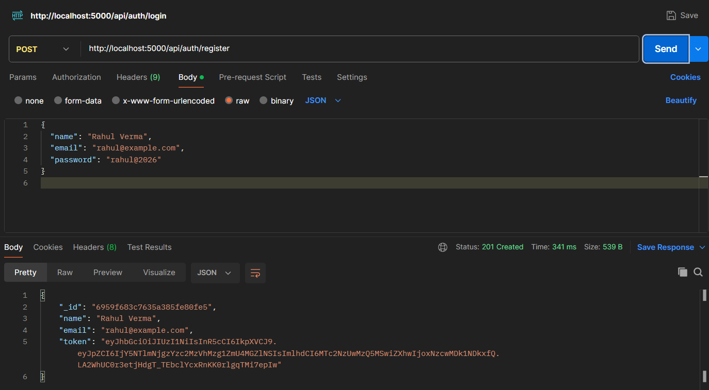
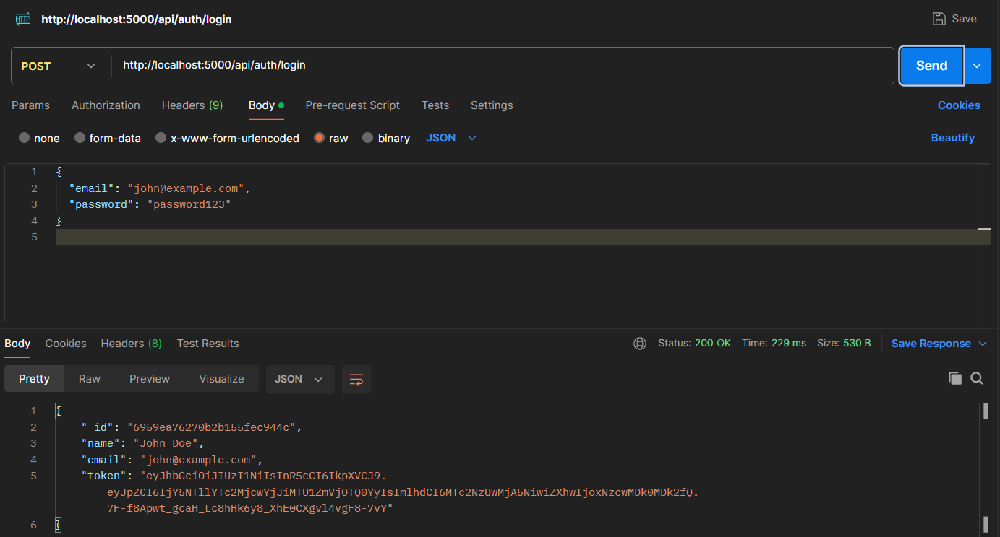
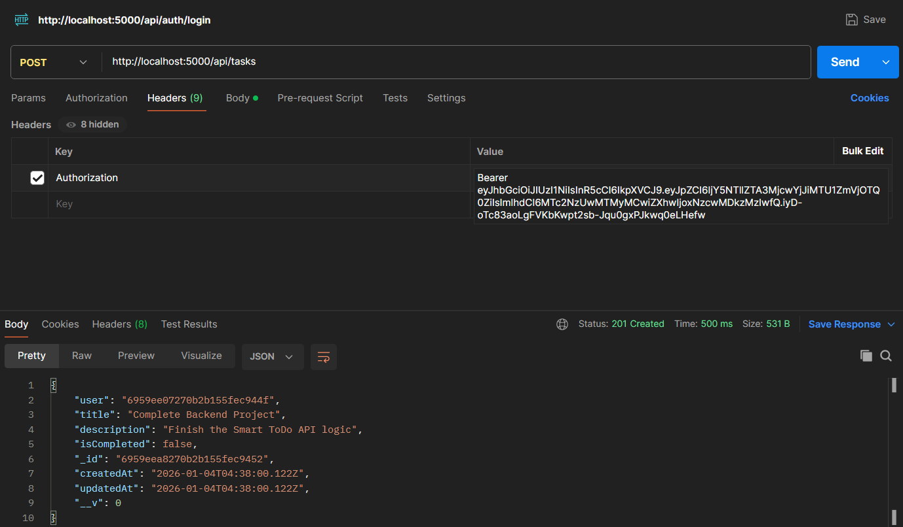
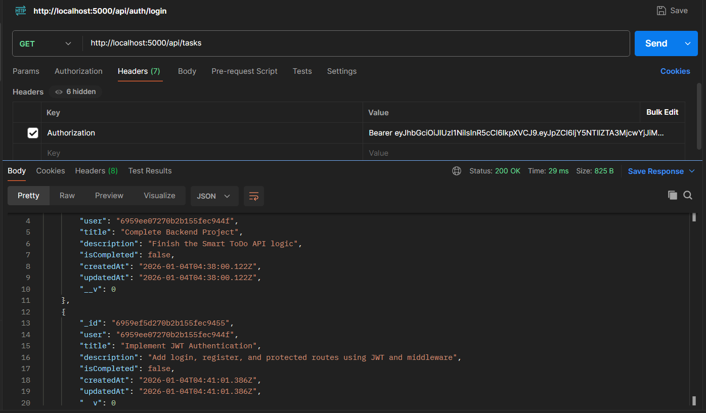
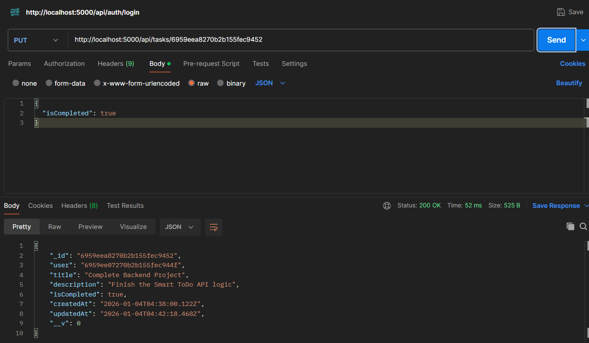
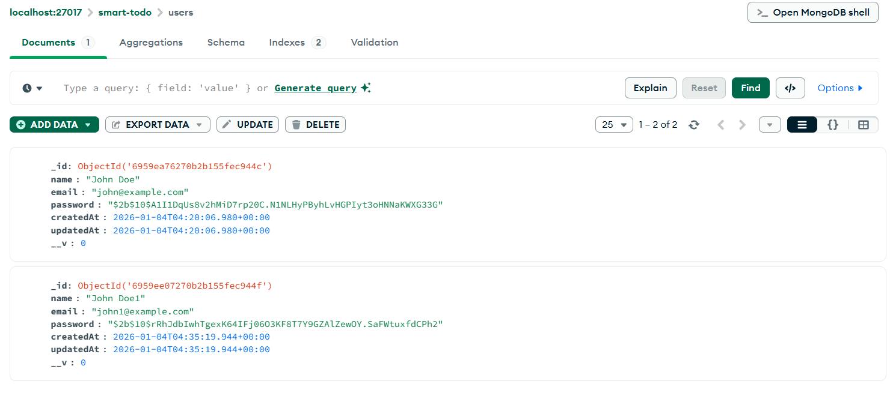
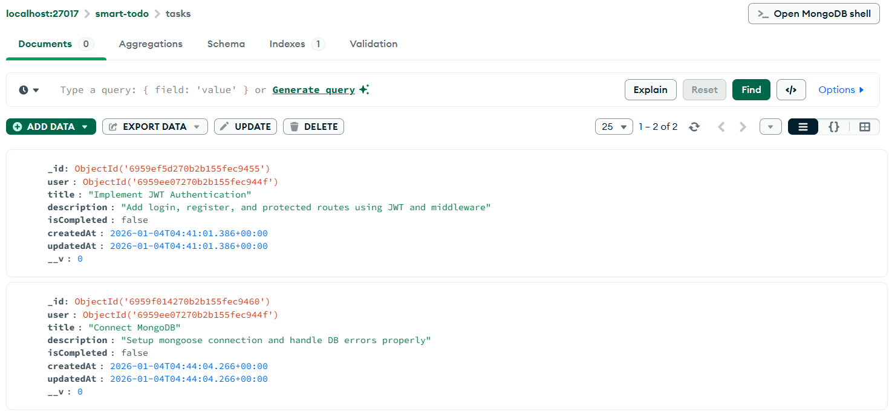

# Smart ToDo API - REST Backend

A secure and robust RESTful API built with Node.js, Express, and MongoDB for managing tasks. This project handles user authentication using JWT (JSON Web Tokens) and performs full CRUD (Create, Read, Update, Delete) operations on tasks, ensuring data isolation so users can only manage their own tasks.

---

## 📸 Project Snapshot


**Postman API Testing:**

* **User Registration:**
    

* **User Login:**
    

* **Create Task:**
    

* **Get All Tasks:**
    

* **Update Task:**
    

* **Delete Task:**
    

**MongoDB Database View:**


**Users Collection:**


**Tasks Collection:**


---

## ✨ Key Features

* **User Authentication:** Secure user registration and login.
* **Password Security:** Passwords are hashed using `bcryptjs` before storage.
* **JWT Authorization:** Protected routes using JSON Web Tokens to ensure only authenticated users access data.
* **Task Management:** Full CRUD capabilities for tasks (Title, Description, Completion Status).
* **Data Isolation:** Middleware ensures users can only view, update, or delete tasks belonging to them.
* **MVC Architecture:** Clean and organized codebase using Model-View-Controller patterns.

---

## 🛠️ Tech Stack

* **Runtime Environment:** Node.js
* **Framework:** Express.js
* **Database:** MongoDB (NoSQL)
* **ODM (Object Data Modeling):** Mongoose
* **Authentication:** JWT (jsonwebtoken) & bcryptjs
* **Environment Management:** dotenv

---

## 🚀 Getting Started

Follow these steps to set up and run the project locally.

### Prerequisites

* Node.js installed on your machine.
* MongoDB installed locally OR a MongoDB Atlas Cloud account.

### Installation Steps

1.  **Clone the repository:**
    ```bash
    git clone <your-repo-url-here>
    cd smart-todo-api
    ```

2.  **Install dependencies:**
    ```bash
    npm install
    ```

3.  **Environment Configuration:**
    Create a file named `.env` in the root directory and add the following variables. Change the values to match your setup.

    ```env
    PORT=5000
    # Use your local DB string OR MongoDB Atlas connection string
    MONGO_URI=mongodb://localhost:27017/smart-todo
    # Change this to a long, random string for security
    JWT_SECRET=your_super_secret_key_here
    ```

4.  **Run the Server:**
    For development (with nodemon for auto-restart):
    ```bash
    npm run dev
    ```
    *The server should start on `http://localhost:5000`*

---

## 📡 API Endpoints

Use a tool like Postman or Thunder Client to test these endpoints.

### Authentication

| Method | Endpoint             | Description             | Auth Required | Body Parameters             |
| :---   | :---                 | :---                    | :---:         | :---                        |
| POST   | `/api/auth/register` | Register a new user     | No            | `name`, `email`, `password` |
| POST   | `/api/auth/login`    | Login user & get Token  | No            | `email`, `password`         |

### Tasks

**⚠️ Important:** All Task routes are protected. You must include the token received from logging in in the request header:
* **Key:** `Authorization`
* **Value:** `Bearer <YOUR_TOKEN_HERE>` (Don't forget the space after 'Bearer')

| Method | Endpoint          | Description                  | Body Parameters                    |
| :---   | :---              | :---                         | :---                               |
| GET    | `/api/tasks`      | Get all tasks for logged user| N/A                                |
| POST   | `/api/tasks`      | Create a new task            | `title` (required), `description`  |
| PUT    | `/api/tasks/:id`  | Update an existing task      | `title`, `description`, `isCompleted` |
| DELETE | `/api/tasks/:id`  | Delete a task                | N/A                                |

---

## 📁 Project Structure

```text
smart-todo-api/
├── config/db.js             # MongoDB connection logic
├── middleware/authMiddleware.js # JWT verification middleware
├── models/
│   ├── Task.js              # Task Schema
│   └── User.js              # User Schema
├── routes/
│   ├── authRoutes.js        # Authentication API routes
│   └── taskRoutes.js        # Task API routes
├── .env                     # Environment variables (not committed to git)
├── server.js                # App entry point
└── package.json             # Dependencies and scripts